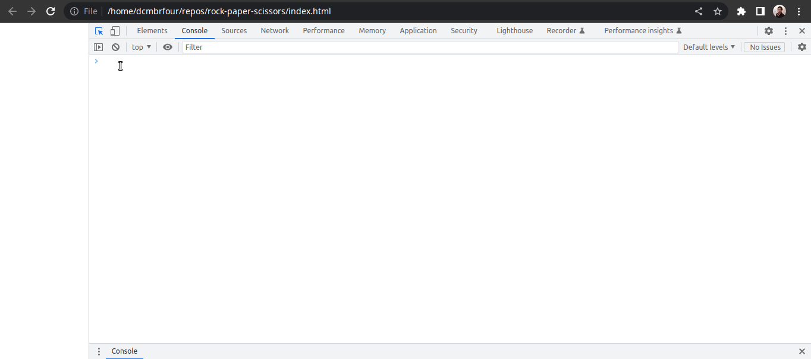

# Classic Game of Rock Paper Scissors
Live Demo: https://daryldelrosario.github.io/rock-paper-scissors/   
<kbd></kbd>

## Acknowledgements
* The Odin Project: https://theodinproject.com

## Requirements
https://www.theodinproject.com/lessons/foundations-rock-paper-scissors

## Brief Description
This is a JavaScript program built from scratch.   

It is a five round program of the school-grade game 'Rock-Paper-Scissors'. The program prompts the user to choose between 'Rock-Paper-Scissors' and the computer has a function that randomly generates an option for each round.   

## Technologies Used
* HTML
* JavaScript

## Features
* The prompt used to take in the input from user is non-case sensitive
* Each round tracks and displays:   
    * what the player chose
    * what the computer chose
    * who won the round
    * the winner after five rounds   

## How to Use the Program
1. Open the program: https://daryldelrosario.github.io/rock-paper-scissors/
2. Right click and Inspect
    * Alternatively Open Dev Tools `CTRL + SHIFT + C`
3. Open Console
4. Use the function `game();`
5. Type `Rock` `Paper` or `Scissors` to choose
6. Play for five(5) rounds
7. Winner is announced at the end

## Updates
### Thursday, October 27, 2022
* 1119pm: Completed the Rock Paper Scissors using JavaScript only
